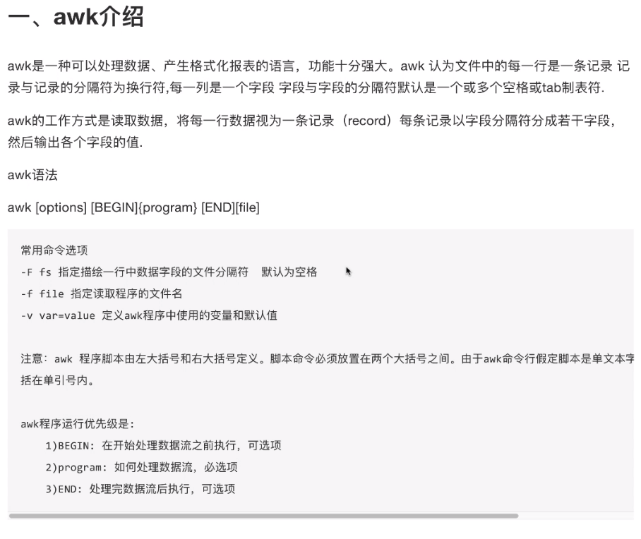

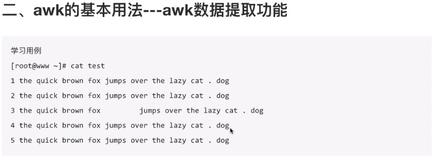

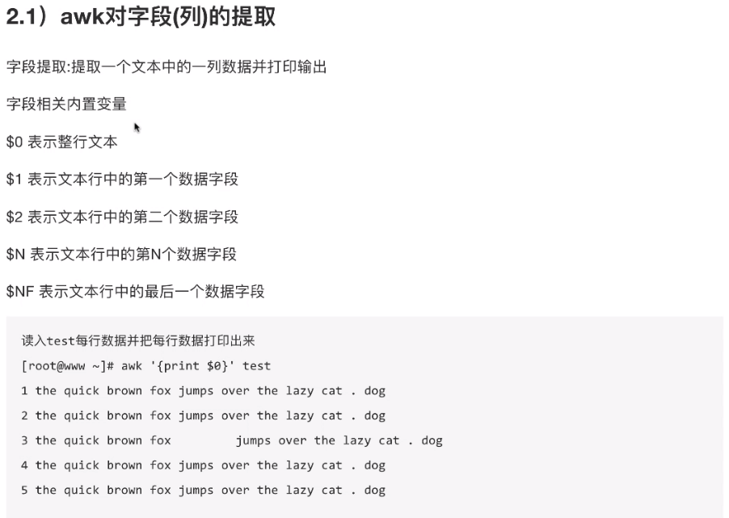

```sh
#打印某一列
awk '{print $0}' test
awk '{print $3}' test
awk '{print $NF}' test
#打印某一行
awk 'NR==3{print $0}' test
#指定分隔符
awk -F ":" 'NR==3{print $1,$4}' test
awk -F ":" 'NR==3{print $1 "-" $4}' test

```

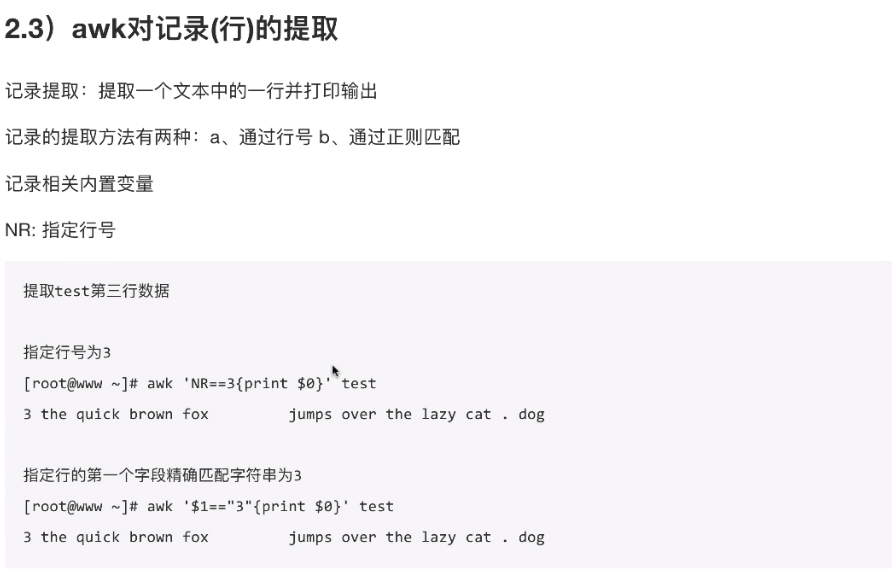

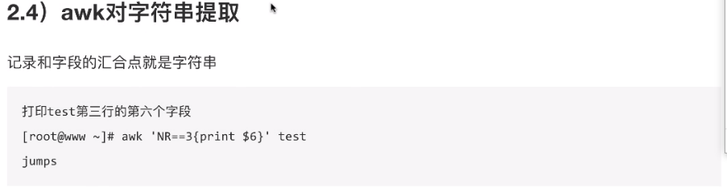

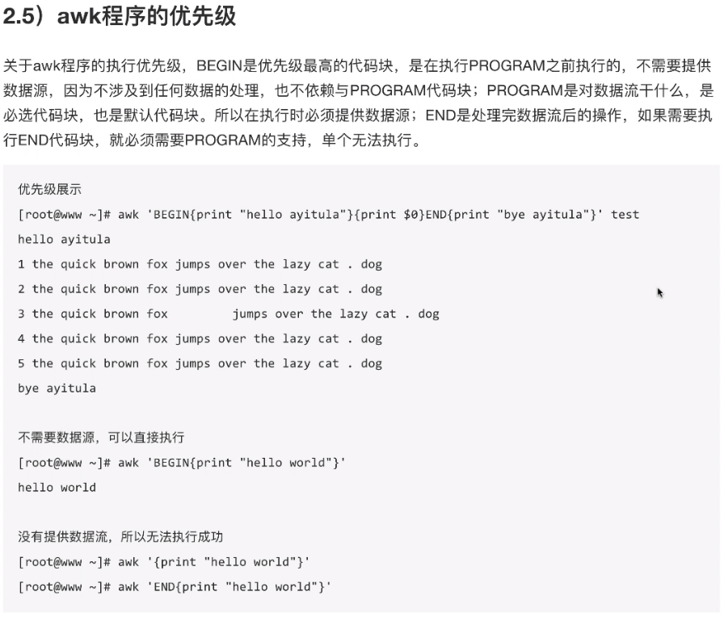


```sh
#内存使用率
head -2 /proc/meminfo | awk 'NR==1{t=$2}NR==2{f=$2;print (t-f)*100/t "%"}'
```

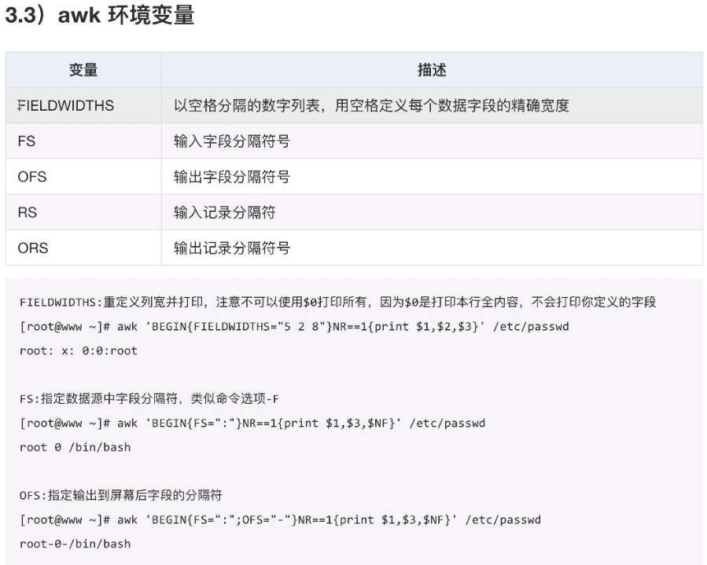

### 流程控制

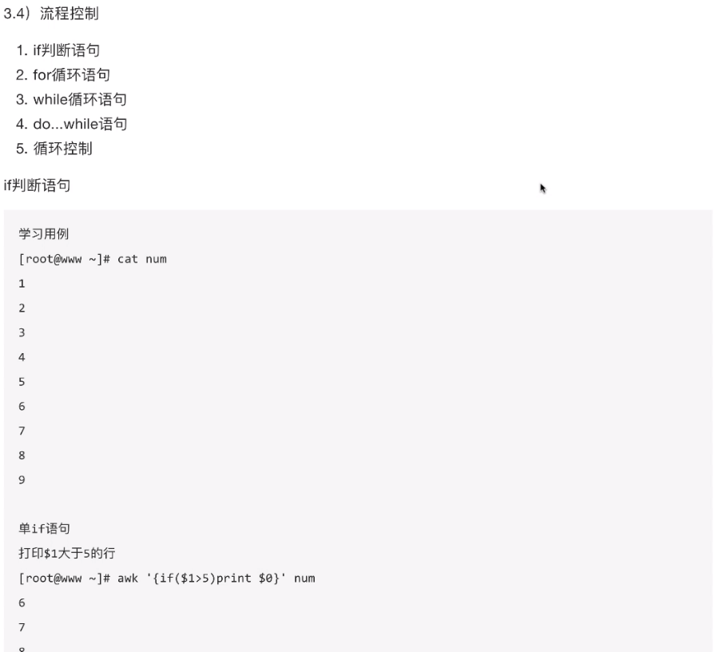

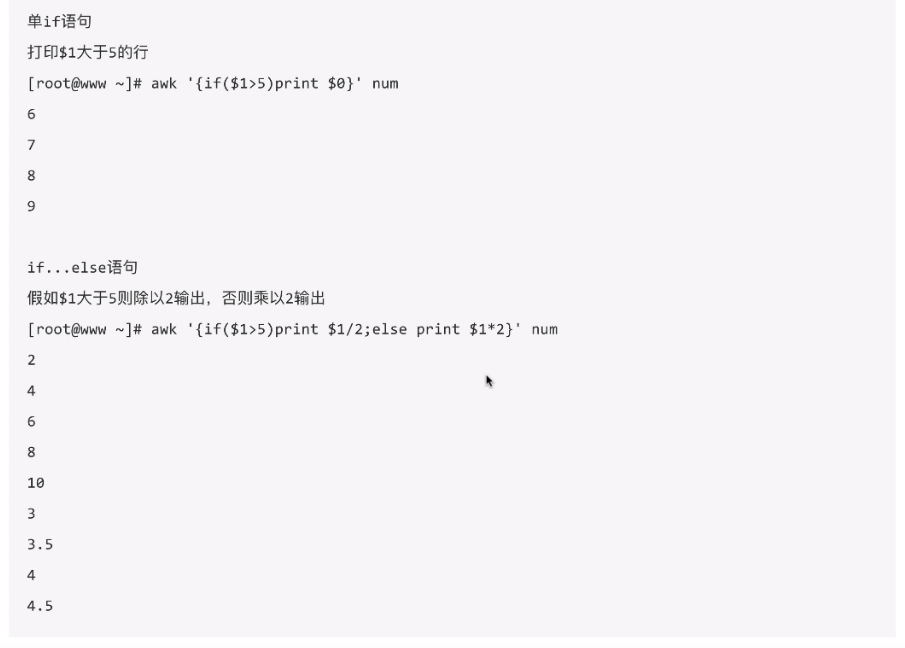

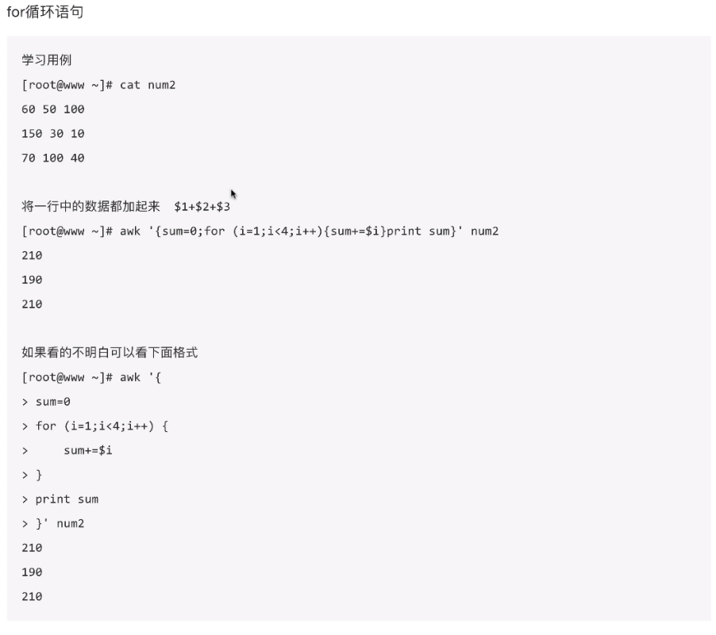

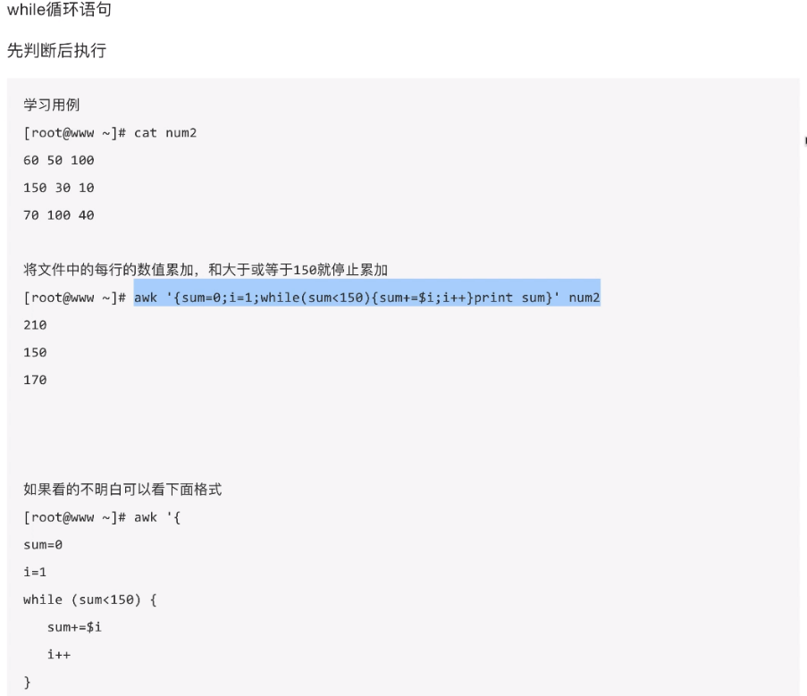

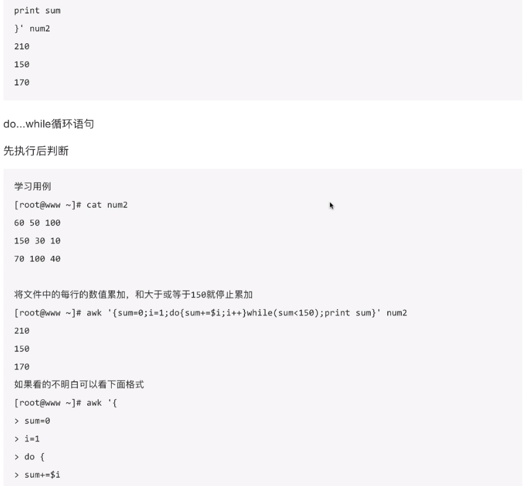

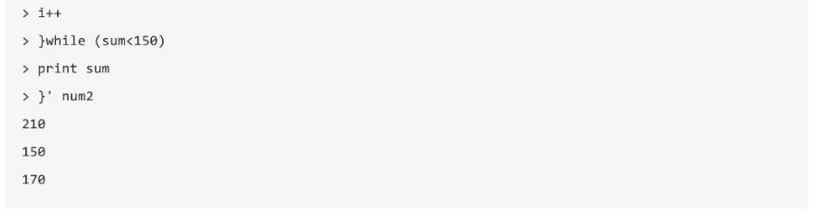

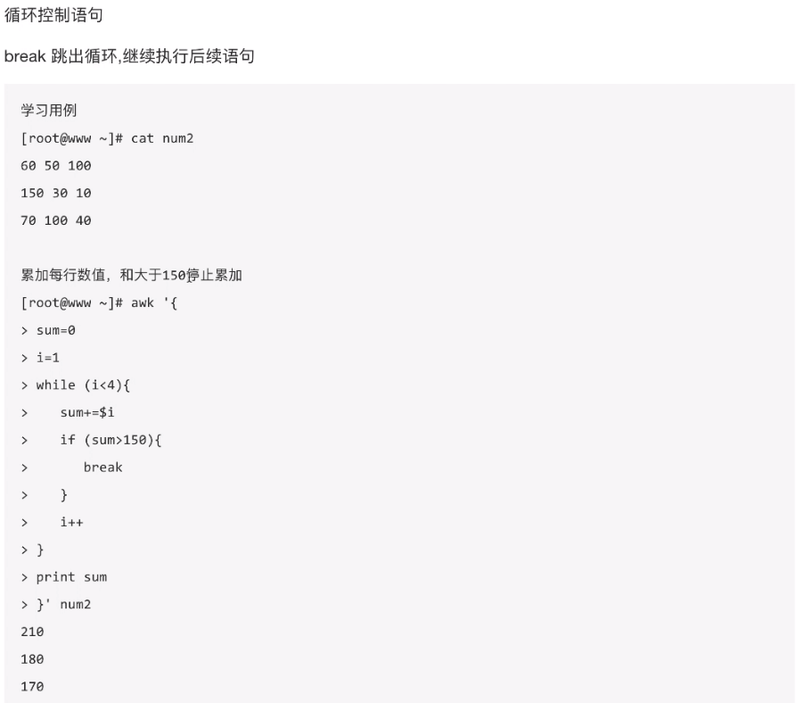

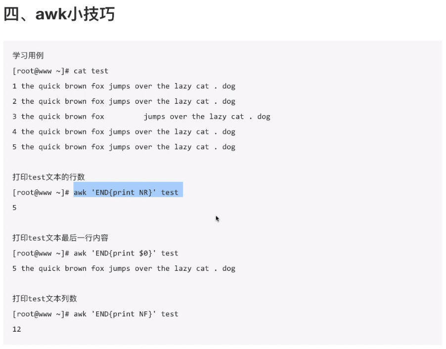

